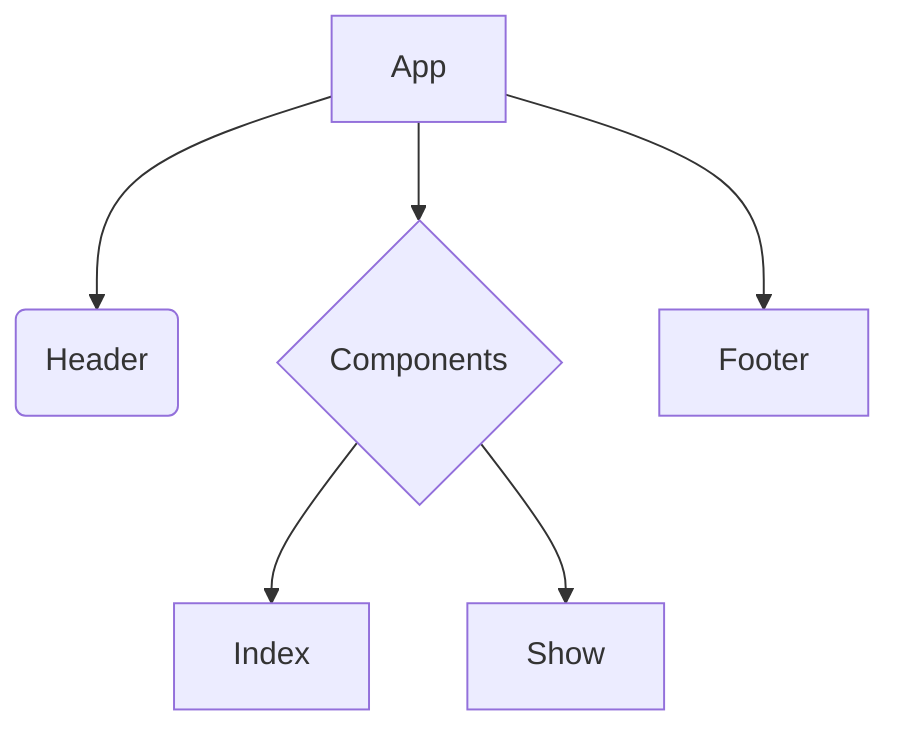

# Product Requirements Documentation
### By Haley Zitzmann

**Summary**
| Field | Detail |
|-------|--------|
| Bloodbanking App | {Blood Bank Testing}|
| Description | {I am building a full CRUD application that allows the users to add new patients and add and modify blood bank testing to the patient chart.} |
| Developers | {Haley Zitzmann} |
| Live Website | {} |
| Repo | {} |

## User Stories

List of stories users should experience when using the application.

- Users should be able to see the site on desktop and mobile
- Users can create a new patient chart
- Users can see all the patient charts on the dashboard
- Users can update patient chart
- User can delete patient charts

## Route Tables

| Endpoint | Method | Response | Other |
| -------- | ------ | -------- | ----- |
| /item | GET | JSON of all patients | |
| /item | POST | Create new item return JSON of new patient | body must include data for new patient |
| /item/:id | GET | JSON of patient with matching id number | |
| /item/:id | PUT | update patient chart with matching idea, return its JSON | body must include updated data |
| /item/:id | DELETE | delete the patient chart with the matching id | |
| /auth/signup | POST | creates new user account returns user JSON | new user info must be included in body |
| /auth/login | POST | logs in user and returns user JSON with JWT token | username and password must be included in body |

## Component Architecture

